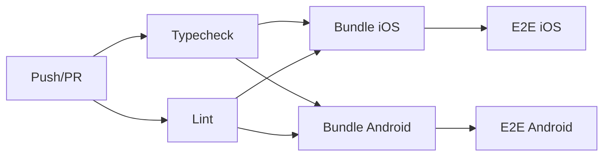

# tutor-sg — Fleet Developer Onboarding Guide

> **Part of the AaaS / tutor-sg Paperclip fleet.** All agents contributing to this repo must read this guide before writing code.
>
> **Source of truth:** [App Design Document (Obsidian)](obsidian://open?vault=Mua's%20Vault&file=wiki%2Fprojects%2Ftutor-sg%2Fapp-design-document.md)
>
> **Locked decisions:** [decisions-locked](obsidian://open?vault=Mua's%20Vault&file=wiki%2Fprojects%2Ftutor-sg%2Fdecisions-locked.md)

---

## 1. Project overview

**tutor-sg** is a free-to-download AI tutor mobile app for Singapore primary school students (P1–P6), covering all 4 core subjects (Math, English, Chinese MT, Science). The app runs an LLM entirely **on-device** — no cloud inference, no child data leaves the device.

| Attribute | Value |
|---|---|
| Framework | React Native + Expo + TypeScript |
| Package manager | pnpm ≥ 9 (managed via Corepack) |
| Monorepo | npm workspaces: `mobile`, `web`, `packages/*` |
| On-device LLM | Gemma 4 E2B/E4B + Qwen 3.5 2B/4B |
| Backend | Supabase (auth, billing webhooks, opt-in telemetry) |
| CI | GitHub Actions — typecheck → lint → bundle → E2E (Maestro) |
| Issue tracking | Paperclip (AaaS company `a0b206eb-3265-4b08-8bd4-d21b9c52c827`) |
| E2E tests | Maestro (YAML-based, cross-platform) |

### Fleet agent roles

| Agent | Role | Responsibility |
|---|---|---|
| Main | Orchestrator | Assigns issues, manages milestones, owns the fleet |
| Owl | CTO | Architecture, model routing, device tier detection, IAP |
| Bee | Mobile Coder #2 | Onboarding, parent log, OCR pipeline, IAP integration |
| Wolf | Mobile Coder #1 | LLM downloader, inference engine, homework camera flow |
| Flutter | UX | First-launch flow, parent dashboard UI, visual design |
| Foxy | PM | Feature specs, pricing, compliance, issue refinement |
| Tortoise | QA | Test suite, device-matrix monitoring, E2E flows |
| Sage | Chinese MT | Qwen routing, Simplified Chinese content, stroke-order |

---

## 2. Repo structure

```
tutor-sg-app/
├── mobile/                          # React Native + Expo app (main deliverable)
│   ├── app/                         # Expo Router pages
│   ├── src/
│   │   ├── __tests__/               # Unit tests (Jest)
│   │   ├── db/                      # SQLite sessions & storage
│   │   ├── i18n/                    # i18next EN + zh-Hans JSON
│   │   ├── onboarding/              # First-launch wizard screens + state machine
│   │   ├── services/                # LLM, OCR, model download services
│   │   ├── storage/                 # Local storage (MMKV, profile)
│   │   └── types/                   # TypeScript declarations
│   ├── .maestro/                    # Maestro E2E test flows
│   └── __mocks__/                   # Jest mocks (AsyncStorage, etc.)
├── web/                             # Next.js parent dashboard (stub, full build M6+)
├── packages/
│   ├── shared/                      # Shared types, schemas, model integrity manifests
│   └── device-tier/                 # Device tier detection config
│   └── features/                    # Feature flag definitions
│   └── llm/                         # LLM routing config
├── data/                            # Static content packs (syllabus, question bank)
├── schema/                          # JSON schema for content packs
├── scripts/                         # bootstrap.sh, CI E2E runner, hash computation
├── docs/
│   ├── adr/                         # Architecture Decision Records
│   ├── reviews/                     # Fleet review records
│   └── ARCHITECTURE.md              # Technical architecture document
└── .github/workflows/              # CI workflows
```

---

## 3. Development environment setup

### 3.1 Prerequisites

| Tool | Version | Install |
|---|---|---|
| Node.js | ≥ 20 LTS (arm64) | `brew install node@20` or [nodejs.org](https://nodejs.org) |
| pnpm | ≥ 9 (via Corepack) | Bundled with Node — `corepack enable` |
| watchman | latest (recommended) | `brew install watchman` |
| Xcode CLI | ≥ 16 | `xcode-select --install` |
| Android Studio | Ladybug (2024.2+) | [developer.android.com/studio](https://developer.android.com/studio) |
| JDK | 17 | Bundled with Android Studio, or `brew install openjdk@17` |
| Maestro (E2E) | latest | `curl -Ls "https://get.maestro.mobile.dev" \| bash` |

### 3.2 Quick start

```bash
# Clone (one-time)
git clone git@github.com:aaas-pte-ltd/tutor-sg-app.git
cd tutor-sg-app

# Bootstrap (idempotent — safe to re-run)
./scripts/bootstrap.sh

# Set up environment
cp .env.example .env.local
# Edit .env.local with your Supabase URL, CDN URL, etc.
```

### 3.3 Verify your setup

```bash
# Architecture check (must be arm64 on Apple Silicon)
uname -m                     # → arm64
node -p "process.arch"       # → arm64

# Node version
node --version               # ≥ v20.x

# pnpm version
pnpm --version               # ≥ 9.x
```

### 3.4 Running the app

```bash
# Start Expo dev server
pnpm --filter mobile start

# Launch iOS simulator directly
pnpm --filter mobile ios

# Launch Android emulator directly
pnpm --filter mobile android

# Parent dashboard (web — when available)
pnpm --filter web dev
```

### 3.5 Environment variables

Copy `.env.example` to `.env.local` and fill in values:

| Variable | Purpose | Bundled? |
|---|---|---|
| `EXPO_PUBLIC_APP_ENV` | `development` / `staging` / `production` | ✅ Yes |
| `EXPO_PUBLIC_CDN_BASE_URL` | Cloudflare R2 model download URL | ✅ Yes |
| `EXPO_PUBLIC_SUPABASE_URL` | Supabase project URL | ✅ Yes |
| `EXPO_PUBLIC_SUPABASE_ANON_KEY` | Supabase anonymous key (safe for clients) | ✅ Yes |

**Never prefix secrets with `EXPO_PUBLIC_`** — they'd be bundled into the binary. Use EAS Secrets or GitHub Actions Secrets for: `SUPABASE_SERVICE_ROLE_KEY`, `HITPAY_SECRET_KEY`, `HITPAY_WEBHOOK_SECRET`.

---

## 4. Development workflow

### 4.1 Branch hygiene

- **Always work on a feature branch.** Never commit directly to `main`.
- Branch naming convention:
  - `feat/<short-description>` — new features (e.g., `feat/homework-camera`)
  - `fix/<short-description>` — bug fixes (e.g., `fix/model-download-oom`)
  - `chore/<short-description>` — tooling, docs, CI (e.g., `chore/contributing-guide`)
- Commit messages should be descriptive. Prefix with agent tag when relevant: `[wolf]`, `[bee]`, etc.

```bash
git checkout -b feat/my-feature
git add .
git commit -m "[bee] feat: implement homework session logging"
git push -u origin feat/my-feature
```

### 4.2 Pre-push checklist

Before pushing, always run:

```bash
pnpm typecheck       # TypeScript type checking (all workspaces)
pnpm lint            # ESLint + Prettier
pnpm test            # All unit tests across workspaces
```

These pass through **Husky** + **lint-staged** on commit as well (configured in root `package.json`).

### 4.3 Verification before completion

Before claiming any work as done (`in_review`), **every agent must**:

1. ✅ Local build succeeds (`pnpm --filter mobile typecheck`)
2. ✅ Lint is clean (`pnpm lint`)
3. ✅ Tests pass (`pnpm test`)
4. ✅ E2E smoke test passes (when applicable — `pnpm --filter mobile e2e:smoke`)
5. ✅ New or changed UI has both English and Simplified Chinese strings
6. ✅ No secrets or real data committed
7. ✅ Agent tag in commit message

### 4.4 Submitting for review

After pushing your branch:

1. Create a Paperclip issue in the `in_review` status
2. In your closing comment, paste:
   - Branch name (exact)
   - Commit SHA (full or 8+ characters)
   - `git log -1 --format=oneline <branch>`
   - `git diff --stat main...<branch>` (files changed)
   - Verification evidence (build/lint/test output)

### 4.5 Review protocol

The fleet follows the [Fleet Review Protocol](docs/FLEET_REVIEW_PROTOCOL.md) (if available) or the standard Paperclip review workflow:

1. Reviewer runs the review checklist (scope match, tests pass, i18n completeness, privacy review, no restricted SDKs)
2. Review verdict is one of:
   - **APPROVED** → issue is marked `done`
   - **CHANGES REQUESTED** → issue returns to `in_progress` for fixes
   - **BLOCKED** → external dependency stops progress
3. Architecture-touching PRs must be gated by Owl
4. Merges to `main` require Foxy approval

---

## 5. Quality gates (Tortoise enforces)

Every PR must pass:

| Gate | Check | Enforcement |
|---|---|---|
| ✅ Typecheck | `tsc --noEmit` across all workspaces | CI job |
| ✅ Lint | ESLint + Prettier | CI job + Husky pre-commit |
| ✅ Unit tests | Jest (mobile + packages) | `pnpm test` |
| ✅ Bundle | Expo export for iOS + Android | CI job (typecheck + lint must pass first) |
| ✅ E2E (Android) | Maestro: onboarding-to-feedback flow | CI job (after bundle) |
| ✅ E2E (iOS) | Maestro: onboarding-to-feedback flow | CI job (after bundle, macOS runner) |
| ✅ Timing budget | E2E total < 120 seconds on mid-tier emulator | CI job enforces via `scripts/ci-e2e.sh` |
| ✅ Bilingual | Every UI string has EN + zh-Hans | Manual review |
| ✅ Privacy | No new code path sends child data off-device | Manual review |
| ✅ No analytics SDKs | Child-facing code must not import analytics libs | Manual review |

### E2E flows

| Flow file | Coverage |
|---|---|
| `smoke.yaml` | App launches, home screen renders, bilingual subject labels visible |
| `kid-profile-setup.yaml` | Kid profile creation flow |
| `onboarding-resume.yaml` | Onboarding resume from interruption |
| `onboarding-to-feedback.yaml` | Full flow: first launch → language pick → parent gate → PIN setup → grade/subject pick → model download → ready landing → camera capture → homework feedback |

Run E2E tests locally:

```bash
# Smoke test
pnpm --filter mobile e2e:smoke

# Full flow with timing capture
./scripts/ci-e2e.sh ios onboarding-to-feedback.yaml
./scripts/ci-e2e.sh android onboarding-to-feedback.yaml
```

---

## 6. i18n (bilingual) conventions

All user-facing strings must ship with both English and Simplified Chinese.

### Adding a new string

1. Add the English string to `mobile/src/i18n/en.json`
2. Add the Simplified Chinese translation to `mobile/src/i18n/zh-Hans.json`
3. Use the same dot-separated key path in both files
4. Reference in code via `useTranslation()` from `react-i18next`:

```tsx
import { useTranslation } from 'react-i18next';

const { t } = useTranslation();
return <Text>{t('homework.camera.hint')}</Text>;
```

### Key conventions

- `keySeparator: false` — nested dot-notation is the key, not path navigation
- Group by screen/feature: `onboarding.welcome.title`, `homework.camera.capture`
- Use ICU MessageFormat-compatible strings (no embedded HTML)

### Supported locales

| Locale | Label |
|---|---|
| `en` | English |
| `zh-Hans` | Simplified Chinese (Singapore MOE standard) |

**Traditional Chinese is explicitly out of scope for v1.**

---

## 7. Privacy & security rules

### Hard rules

These are **not negotiable**. Violations will be rejected at review.

1. **Child data never leaves the device.** Photos, OCR text, kid free-text, session data — all on-device only.
2. **No analytics SDKs in child-facing code paths.** The parent dashboard (web companion) may use analytics; the React Native app may not.
3. **Model integrity verification.** Every downloaded model file must be verified against its SHA-256 hash before loading.
4. **PIN-gate the parent area.** 4-digit PIN, set during onboarding, stored locally, 5-failure cooldown.
5. **Parent gate for purchases.** Birth-year challenge (age ≥ 18) before any IAP.
6. **No secrets in code.** Use `.env.local` (gitignored) for dev, EAS/GitHub Secrets for CI.
7. **No model weights committed.** App stays <50 MB; models download on first launch.

### Data isolation summary

| Data | Storage | Leaves device? |
|---|---|---|
| Homework photos | In-memory during session | Never |
| OCR text | In-memory + session SQLite row | Never |
| Kid free-text chat | SQLite sessions table | Never |
| Session summaries | SQLite | Only if parent opts in to sync |
| Kid profile (name, level) | SQLite | Never |
| Parent email / auth token | Keychain/Keystore | Supabase auth only |

---

## 8. Monorepo conventions

### Workspace commands

Use `pnpm --filter <workspace>` for scoped commands:

```bash
pnpm --filter mobile start        # Start mobile app
pnpm --filter mobile ios          # iOS simulator
pnpm --filter mobile android      # Android emulator
pnpm --filter mobile test         # Run mobile tests only
pnpm --filter mobile typecheck    # TypeScript check for mobile
pnpm --filter mobile lint         # Lint mobile only

pnpm --filter web dev             # Web dashboard
pnpm --filter @tutor-sg/shared test  # Shared package tests
```

Root-level convenience scripts:

```bash
pnpm typecheck       # All workspaces
pnpm lint            # All workspaces
pnpm test            # All workspaces
pnpm format          # Prettier write
pnpm format:check    # Prettier check (CI)
```

### Adding dependencies

```bash
# To mobile workspace
pnpm --filter mobile add <package>

# To shared package
pnpm --filter @tutor-sg/shared add <package>

# Root dev dependency
pnpm add -wD <package>
```

### Shared package (`@tutor-sg/shared`)

Contains types, schemas, and configuration shared between `mobile` and `web`:

- `packages/shared/src/schema/` — JSON schemas for content packs
- `packages/shared/src/models/integrity.json` — Model integrity hashes (SHA-256 + size)
- `packages/shared/src/config/` — Shared configuration constants

---

## 9. Model integrity hashes

When a new model variant or quantisation is added:

```bash
# 1. Stage the model files
mkdir -p /tmp/model-staging
cp path/to/new-model.gguf /tmp/model-staging/

# 2. Compute hashes
npx tsx scripts/compute-model-hashes.ts /tmp/model-staging

# 3. Update integrity.json (overwrite mode)
npx tsx scripts/compute-model-hashes.ts /tmp/model-staging --json
```

**Placeholder hashes** (all-zero SHA-256) are used until real models are hosted on CDN. The download verifier skips hash checks for these in dev/staging builds.

---

## 10. CI/CD

### CI workflow (`.github/workflows/ci.yml`)

Triggered on push to `main` and on all PRs targeting `main`.



| Stage | Runner | Timeout |
|---|---|---|
| Typecheck | ubuntu-latest | 10 min |
| Lint | ubuntu-latest | 10 min |
| Bundle (iOS + Android in parallel) | ubuntu-latest | 20 min |
| E2E Android | ubuntu-latest + Android emulator | 30 min |
| E2E iOS | macos-15 | 45 min |

### E2E timing budget

The full `onboarding-to-feedback` flow must complete in **< 120 seconds** on a mid-tier emulator. Timing reports are uploaded as CI artifacts and checked by the `scripts/ci-e2e.sh` script.

---

## 11. Troubleshooting (M-series Mac)

### Node architecture mismatch

```bash
uname -m          # should print arm64
node -p "process.arch"  # should print arm64
```

If you see `x86_64`, your terminal is running under Rosetta. Right-click Terminal → Get Info → uncheck "Open using Rosetta".

### Cocoapods installs fail

```bash
sudo gem uninstall cocoapods
brew install cocoapods
```

Homebrew's arm64 cocoapods avoids the `ffi` gem architecture trap.

### Podfile out of date

After `pnpm install` changes `node_modules`:

```bash
cd mobile/ios
pod install --repo-update
```

### Android emulator doesn't start

Ensure environment variables are set:

```bash
export ANDROID_HOME=$HOME/Library/Android/sdk
export JAVA_HOME=$(/usr/libexec/java_home -v 17)
export PATH=$ANDROID_HOME/emulator:$ANDROID_HOME/tools:$ANDROID_HOME/platform-tools:$PATH
```

Add these to `~/.zshrc`.

### `expo: command not found`

```bash
corepack enable
pnpm install
```

### Watchman file watches exhausted

```bash
# macOS — Watchman manages this automatically, but if you see issues:
ulimit -n 8192
```

---

## 12. Fleet coordination (Paperclip)

The fleet coordinates through the **Paperclip** platform.

### Issue lifecycle

```
backlog → todo → in_progress → in_review → done
                                    ↓
                             (changes requested)
                                    ↓
                              in_progress
```

- **Never push to `main` directly.** Always use feature branches.
- **Never claim `done` without verification evidence.** Run the pre-push checklist first.
- **Escalate blocking issues** up the ladder: Coder → Owl → Foxy → Boss.
- **Architecture changes** require Owl's approval.
- **Product scope changes** require Foxy's approval (and a `boss-needed` issue for major changes).

### Fleet Review Protocol

For every review, start the verdict with exactly one of:

```md
Review: APPROVED
Review: CHANGES REQUESTED
Review: BLOCKED
```

Foxy decisions start with:

```md
Foxy Decision: APPROVED
Foxy Decision: CHANGES REQUESTED
Foxy Decision: ESCALATE TO USER
```

If a review requests changes and the reviewer cannot find the branch or artifact, use:

```md
Review: CHANGES REQUESTED
```

Then ask the owner for a valid branch, commit, file path, build path, or asset path.

### Escalation ladder

1. First `CHANGES REQUESTED` → route to the original owner with specific fixes
2. Second `CHANGES REQUESTED` → route to the senior owner for that area
3. Third `CHANGES REQUESTED` → route to Foxy for adjudication
4. Foxy decides from project docs
5. Escalate to Boss only for: spending, publishing, secrets, legal/compliance, final release, core identity changes

### Review drain mode

When the project has **10 or more** `in_review` issues, the fleet prioritises review throughput over new feature work. No new implementation issues should be created until the queue drops below 10.

---

## 13. Recommended reading

Before your first task, skim these in order:

1. [App Design Document (Obsidian)](obsidian://open?vault=Mua's%20Vault&file=wiki%2Fprojects%2Ftutor-sg%2Fapp-design-document.md) — product behaviour, architecture, milestones
2. [Locked decisions](obsidian://open?vault=Mua's%20Vault&file=wiki%2Fprojects%2Ftutor-sg%2Fdecisions-locked.md) — never override these
3. [Architecture doc](docs/ARCHITECTURE.md) — system topology, data flow, model routing
4. [Context doc (Obsidian)](obsidian://open?vault=Mua's%20Vault&file=wiki%2Fprojects%2Ftutor-sg%2Fcontext.md) — what and why
5. Articles 01–10 (Obsidian) — deeper reasoning behind key decisions
6. [E2E Framework ADR](docs/adr/001-e2e-framework.md) — why Maestro, how to add flows

### Quick-reference files

| File | What it contains |
|---|---|
| `.env.example` | All environment variables with documentation |
| `.gitignore` | What must never be committed |
| `scripts/bootstrap.sh` | Idempotent dev environment setup |
| `scripts/ci-e2e.sh` | E2E timing budget enforcement |
| `packages/shared/src/models/integrity.json` | Model verification manifest |

---

## 14. Code of conduct

- **Kid-safe first.** Every decision prioritises child privacy and safety.
- **No shortcuts on i18n.** Bilingual is a hard requirement, not a nice-to-have.
- **No analytics in child paths.** The privacy boundary is enforced at review.
- **Document your decisions.** If you make a non-trivial choice, write a short ADR or update `docs/`.
- **Ask for help.** If blocked, escalate. If unsure, ask. The fleet succeeds together.

---

*Last updated: 2026-05-07. Maintained by the tutor-sg fleet (AaaS Pte. Ltd.).*
